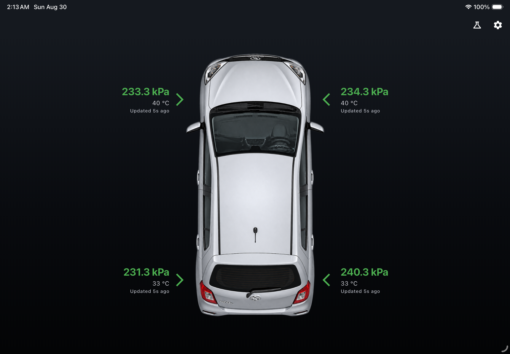
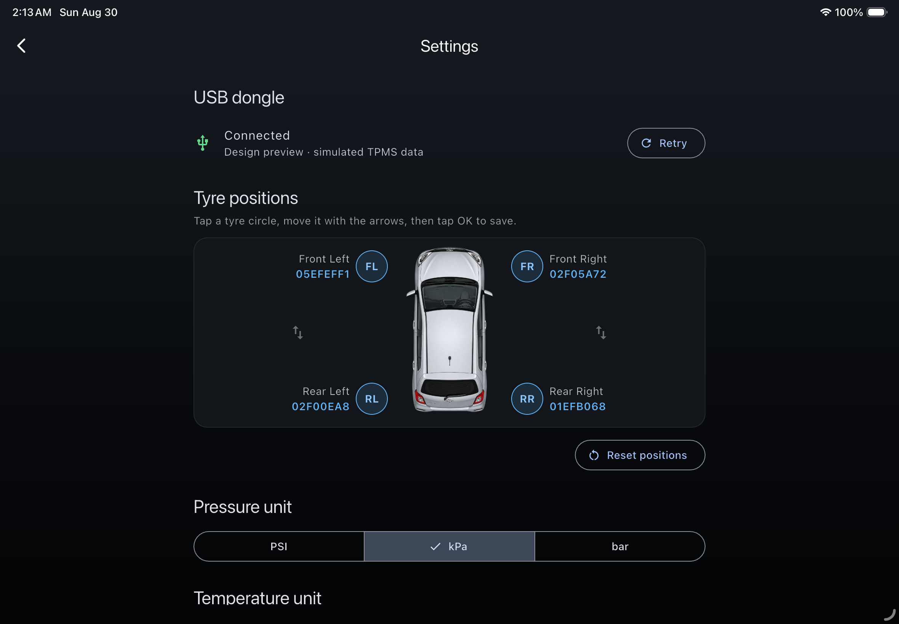
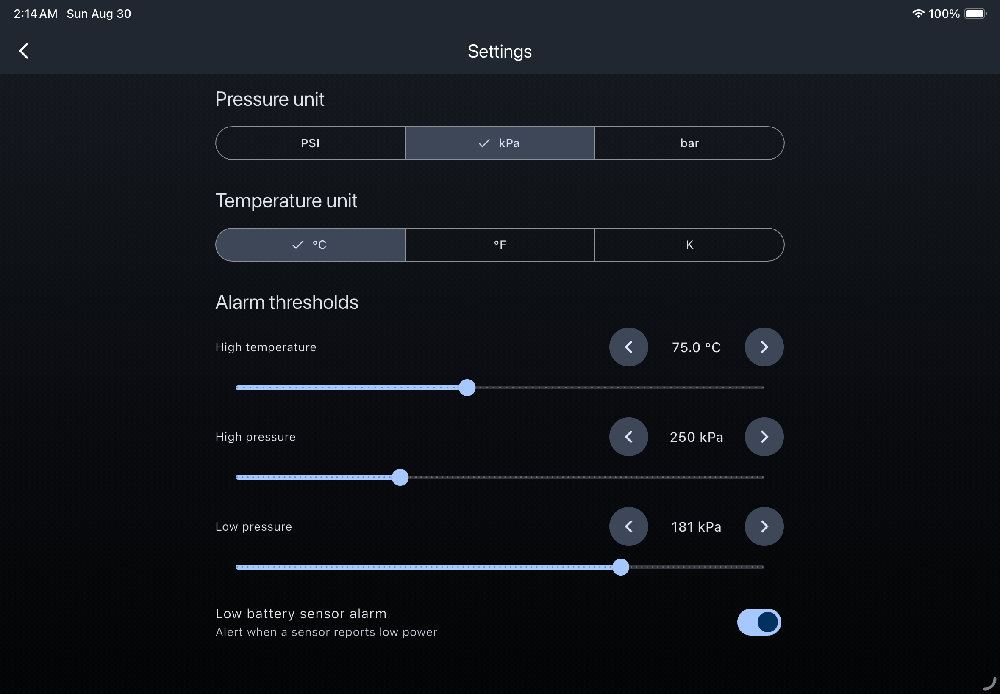

# Axia TPMS Monitor

A landscape Flutter application for displaying tyre pressure and temperature
from an aftermarket USB TPMS kit. It is currently designed around a 2018
Perodua Axia and a CH340-based Android USB receiver.

## Screenshots

### Live dashboard

Pressure, temperature, health colour, and last-update information arranged
around the vehicle.



### Dongle and tyre-position settings

USB connection status and the visual sensor-to-position mapping.



### Units and alarm thresholds

Pressure and temperature units, slider and arrow adjustments, and the low
battery alarm.



## Current features

- Automatically connects to the USB TPMS dongle when the Android app starts.
- Displays pressure, temperature, and last update time for all four tyres.
- Supports PSI, kPa, and bar, plus Celsius, Fahrenheit, and Kelvin.
- Shows healthy readings in green and warnings in red.
- Configurable high-temperature, high-pressure, low-pressure, and low sensor
  battery alarms with queued warning dialogs.
- Alarm values can be changed with large arrow buttons or sliders.
- Tyre positions can be rearranged using a diagram and directional controls.
- Settings and tyre-position mappings are saved locally.
- Uses simulated data outside Android for UI development, refreshed every five
  minutes.
- Locked to a responsive landscape layout and tested at 1024x600 and 640x360.

The science icon is a temporary development control that injects all supported
alarm conditions.

## Hardware and USB protocol

The tested receiver uses:

- USB vendor ID: `0x1A86`
- USB product ID: `0x7523`
- Serial chipset: CH340/CH34x
- Baud rate: `19200`
- Serial format: 8 data bits, 1 stop bit, no parity

An observed packet is eight bytes:

```text
55 AA 08 CC PP TT SS XX
```

- `CC`: dongle tyre channel
- `PP`: pressure (`raw * 3.44` kPa)
- `TT`: temperature (`raw - 50` °C)
- `SS`: sensor status flags
- `XX`: XOR checksum

| Channel | Default position |
| --- | --- |
| `00` | Front-left |
| `01` | Front-right |
| `10` | Rear-left |
| `11` | Rear-right |
| `05` | Optional spare tyre; currently ignored |

## Sensor IDs and position mapping

Initial sensor IDs are configured in
[`lib/config/tire_config.dart`](lib/config/tire_config.dart):

```dart
const Map<String, String> myTires = {
  '05EFEFF1': 'Front-Left',
  '02F05A72': 'Front-Right',
  '02F00EA8': 'Rear-Left',
  '01EFB068': 'Rear-Right',
};
```

These IDs are configured metadata, not IDs detected from each USB packet. The
observed eight-byte packet contains a channel but does **not** contain the
physical sensor ID.

The dongle learns physical sensors and assigns them to channels. Flutter maps
those channel readings onto display positions. After rotating tyres, open
Settings, tap a tyre circle, move it with the directional arrows, preview the
mapping, and select **OK**. This changes only the app's display mapping; it does
not modify dongle pairing.

## Changing the car image

Place the replacement image in `assets/`, then update this value in
[`lib/config/tire_config.dart`](lib/config/tire_config.dart):

```dart
const String carImageAsset = 'assets/axia-bird-viewX.png';
```

The whole `assets/` directory is registered in `pubspec.yaml`. Restart the app
after changing an asset.

## Android USB behaviour

The USB connection starts automatically. Android may request permission the
first time the receiver is used. Connection state, errors, and Retry are shown
in Settings rather than on the dashboard.

The Android manifest registers the USB attachment intent and device filter.
This is a normal TPMS app and is not registered as an Android Home launcher.

## Development

```sh
flutter pub get
flutter run
```

Validation:

```sh
flutter analyze
flutter test
```

Main files:

- `lib/screens/tpms_dashboard.dart`: dashboard, alarms, persistence, and mapping
- `lib/screens/tpms_settings_screen.dart`: settings and position editor
- `lib/services/tpms_usb_service.dart`: USB serial connection and frame buffer
- `lib/services/tpms_parser.dart`: packet validation and decoding
- `lib/services/tpms_fake_service.dart`: simulated design data
- `lib/config/tire_config.dart`: default sensor mapping and car image

## Future improvement: sensor replacement

A future Settings feature may let the user enter the eight-character ID printed
on a replacement sensor. It can validate that:

- The ID contains exactly eight hexadecimal characters (`0-9`, `A-F`).
- The same ID is not assigned to multiple tyres.
- The corresponding dongle channel is receiving telemetry.

It must not claim that the entered ID is verified. Because the current USB
packet does not expose the physical sensor ID, receiving channel data cannot
prove that a manually entered ID belongs to the transmitting sensor.

True verification requires discovering at least one of these capabilities:

1. A dongle command that returns learned sensor IDs.
2. A pairing or learning response containing the new ID.
3. Another USB frame format containing the sensor ID.
4. A supported way to receive the sensor's raw wireless broadcast.

The original TPMS application should be observed during sensor learning to
determine whether it sends a query or programming command. Until that protocol
is understood, a replacement sensor must be paired through the original app or
the dongle manufacturer's procedure. IDs entered into this app would remain
user-provided labels.
